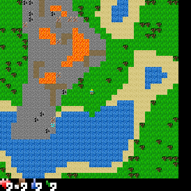

# Craftax Skill Data & Full Observability

This CraftAX extension is an extension of Craftax Classic that introduces a planner for creating segmented and labelled skill traces from the environment. This version streamlines the environment by removing the day/night cycle and mobs, and by reducing the map size to 32x32.

## Features

- **Full Observability:** Be creating a top down pixel map, we achieve full observability. 
- **Segmented Skill Traces:** Create segmented and labelled skill traces using Craftax Classic.
- **Multiple Trace Formats:** Save symbolic traces, pixel traces, and new top-down pixel observations for full observability.
- **PCA Feature Extraction:** Run PCA on top-down observations to extract useful features.
- **Action Appending:** Append actions to the extracted features.
- **Ground Truth & Mapping:** Store ground truth data alongside corresponding mapping information.

## Installation

Install the package in editable mode (with development dependencies) via pip:

```bash
pip install -e ".[dev]"
```

## Usage

### Interactive Mode
Play Craftax Classic interactively by running:

```bash
play_craftax_classic
```

### Running the Planner
Define your custom plan in the `craftax_planner.py` file. Plans should follow this format:

```python
plans = [ 
    (bt.BLOCK_TO_NAVIGATE_TO, [at.ACTION_1, at.ACTION_2, ...], "groundTruth for this skill"),
    # Add additional plan steps as needed
]
```

### Downloading the Expert Dataset
Use the provided script to download the expert dataset (integrated with Hugging Face):

```bash
python download_dataset.py
```

### Running PCA
Extract features from top-down observations by running:

```bash
./batch_pca.sh
```

### Appending Actions
Append actions to your features with:

```bash
./batch_action_append.sh
```

## Folder Structure

```
Traces/
    task_name/
        pca_features/
        top_down_obs/
        pixel_obs/
        actions/
        groundTruth/
        mapping/
```

## Example Top-Down Visualization
